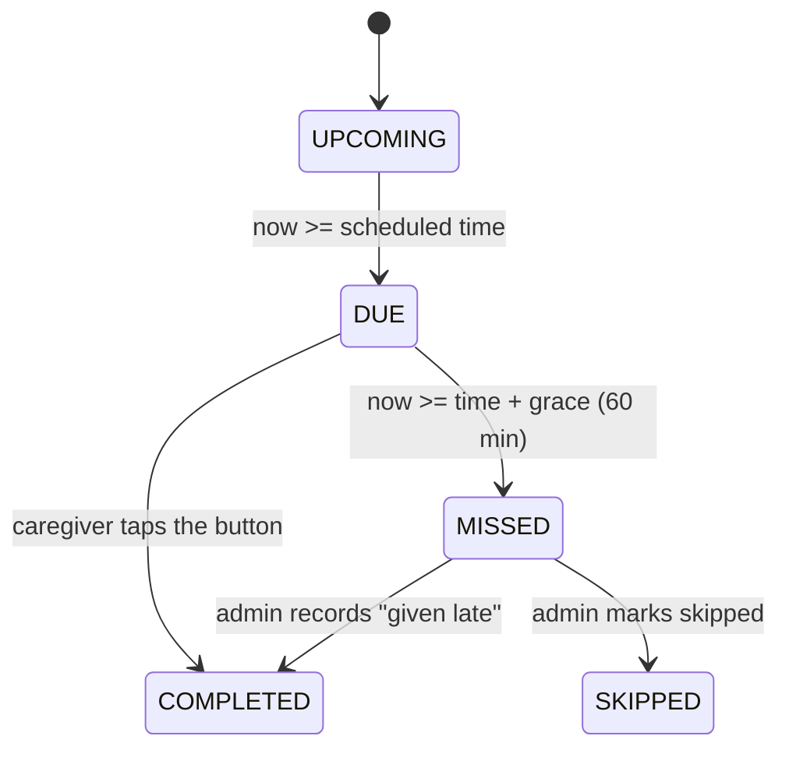
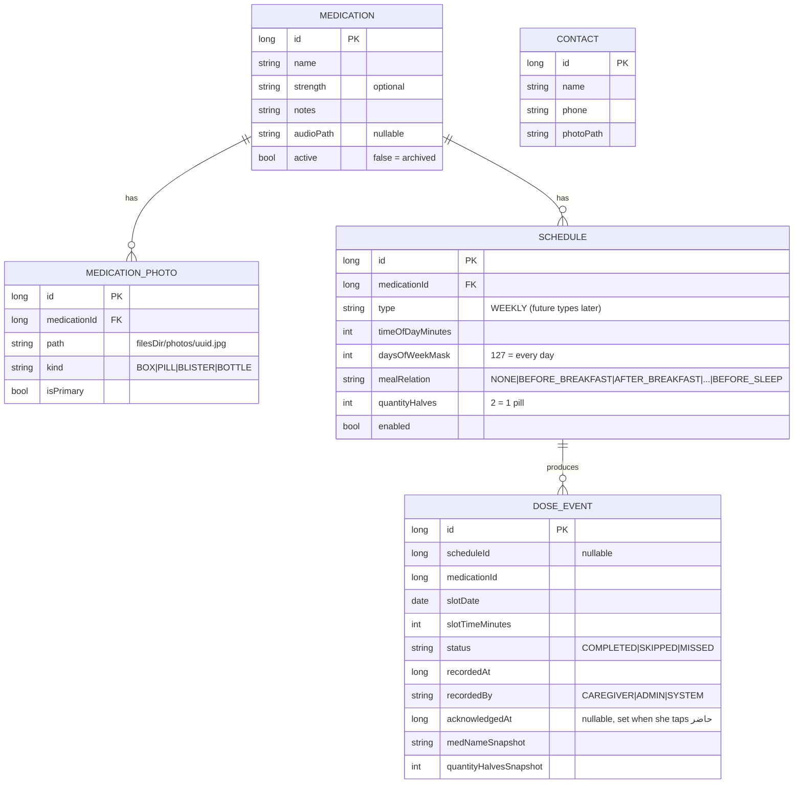
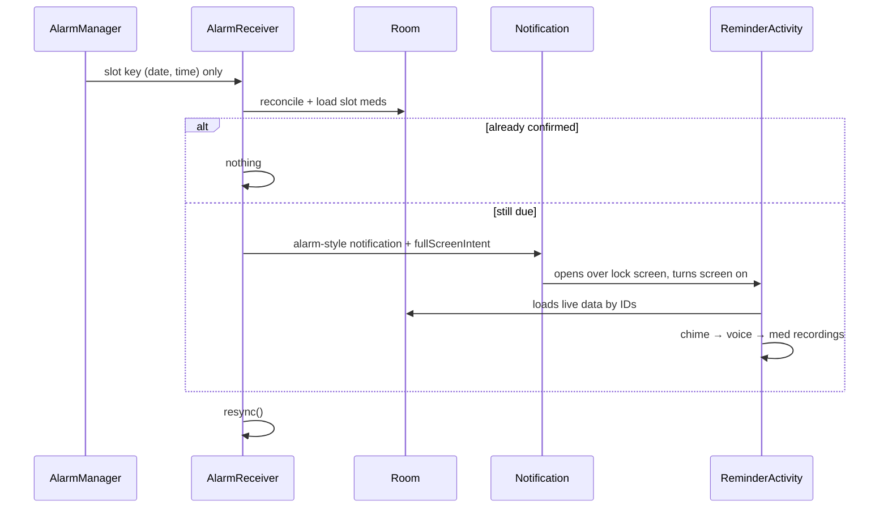

# Dawa (دوا) — Implementation Plan v2

> Visual medication reminder for a caregiver **over 80** who cannot read.
> **North star:** *Correct medicine + correct time + correct photo + one button.*

**Project location:** `/Users/islam/.gemini/antigravity/scratch/dawa` · **Package:** `com.family.dawa`
**Environment:** JDK 17 ✅ · Android SDK 29–36 ✅ · emulator `Pixel_4` ✅ · Gradle wrapper will be generated.

---

## 0. What Changed From v1 (based on your comments)

| Your comment | Change in v2 |
|---|---|
| **Arabic only** | No English at all. No language setting. All strings live in Arabic only, with forced `ar` locale and RTL layout. |
| **Local only, no online at all** | **No `INTERNET` permission** in the manifest. No Firebase, analytics, crash reporting, or downloadable fonts. Cloud backup is disabled (`allowBackup=false`). The Arabic font is bundled inside the app. |
| **Modern design** | New design system (§2.1): calm warm palette, big rounded cards, generous spacing, bundled modern Arabic font, light theme only. |
| **As simple as possible (80+ years)** | The caregiver side is now **ONE screen**: no bottom bar, no navigation, no timeline screen, no countdown, no analog clock, no count dots, no meal badges, no undo popup. Everything else moved to the admin side. |

### Simplification summary

| Removed from the caregiver side | Why | Where it went |
|---|---|---|
| Bottom navigation (Home / Today / Call) | Navigation = confusion | Gone. One screen only. |
| Full timeline screen | Too much information | Admin dashboard. The caregiver gets only a tiny "today dots" strip. |
| Separate Call screen | Extra screen | **One** big call button, shown on the Missed screen |
| Countdown timer, analog clock | Hard to interpret | Just a **sun/moon picture** + the big time |
| Count dots, meal badges, color/shape tags | Visual noise | The voice recording explains "بعد الأكل" if needed |
| Undo popup / confirm dialog | Extra decision | A wrong tap is fixed by the family in the admin History |
| English strings, language setting | Not needed | — |

---

## 1. Product Principles

1. **If grandma has to think, the design failed.**
2. One screen. It only ever shows one of 4 states.
3. Photo → voice → color → (tiny) text.
4. A dose is **never** shown as "give now" outside its time window.
5. The app reminds; it **never** gives medical advice (no late-dose instructions, no auto-reschedule).
6. State is derived from schedule + events + clock, so it's deterministic and testable.
7. 100% on-device. Nothing ever leaves the phone.

### MVP scope

| In v1 | Not built |
|---|---|
| Caregiver single screen (Idle / Due / Done / Missed) + lock-screen reminder | Any online feature (sync, accounts, backup to cloud) |
| Exact alarms, reboot/time-change recovery, repeat ringing while due | Charts / statistics |
| Admin (PIN): meds, photos, schedules, voice, today view, history, contact, settings, health check, disclaimer | English UI |
| Family-recorded voice (main) + on-device Arabic TTS (fallback) | Interval schedules, refills, widgets, multi-patient |
| Debug tools for developers | |

---

## 2. UX Design

### 2.1 Design system ("modern, calm, huge")

| Token | Value |
|---|---|
| **Background** | Warm off-white `#FAF7F2` (never pure white, less glare) |
| **Idle / Done** | Soft green `#2E9E6A` on a light-green surface `#E7F5EE` |
| **Due** | Warm amber `#F2A516` on a light-amber surface `#FFF4DC` |
| **Missed** | Calm red `#D64545` on a light-red surface `#FDECEC` |
| **Text** | Near-black `#1E1E1E`; contrast ≥ 7:1 (AAA) |
| **Font** | **Cairo** or **Tajawal** (bundled `.ttf`, open license). Time is 72sp, labels 34sp, minimum 28sp |
| **Shapes** | 32dp rounded cards, soft elevation, photo cards edge-to-edge inside |
| **Buttons** | Full width, **≥ 120dp tall**, 36sp label + big icon |
| **Motion** | Only one: a gentle pulsing border on Due. No other animations. |
| **Theme** | Light only. Portrait locked. Screen stays on while Due. |

Each state = **full-screen background color + one big icon + photos + one button at most**. Grandma recognizes the state by its color and icon before reading anything.

### 2.2 The only caregiver screen — 4 states

```
① IDLE — "nothing now" (green)        ② DUE — "give these now" (amber)
┌─────────────────────────────┐      ┌─────────────────────────────┐
│                             │      │        🔔                    │
│           ✅ (huge)          │      │   دلوقتي معاد الدوا           │
│      مفيش دوا دلوقتي          │      │ ┌───────────┐┌───────────┐  │
│                             │      │ │           ││           │  │
│  ┌───────────────────────┐  │      │ │  PHOTO A  ││  PHOTO B  │  │
│  │ الجاي:  ☀️  ٢:٠٠       │  │      │ │           ││           │  │
│  │  [photo C]            │  │      │ │    💊     ││   💊💊    │  │
│  └───────────────────────┘  │      │ └───────────┘└───────────┘  │
│                             │      │                             │
│  ✅  🔔  ○  ○   (today dots) │      │ ┌─────────────────────────┐ │
│                        🔊   │      │ │   ✔  اديت الدوا           │ │
└─────────────────────────────┘      │ └─────────────────────────┘ │
                                     │                        🔊   │
                                     └─────────────────────────────┘

③ DONE — (green, 5 s, then → Idle)   ④ MISSED — (red)
┌─────────────────────────────┐      ┌─────────────────────────────┐
│                             │      │         ⛔                   │
│                             │      │      اتأخر معاده              │
│           ✅                 │      │  [photo A]  [photo B]       │
│          (giant)            │      │  (grey with clock badge)    │
│          تمام               │      │ ┌─────────────────────────┐ │
│                             │      │ │ 📞 [photo]  كلّمي ماما    │ │
│   🔊 "تمام، خلصنا"           │      │ └─────────────────────────┘ │
│                             │      │ ┌─────────────────────────┐ │
│                             │      │ │        👍  حاضر          │ │
└─────────────────────────────┘      │ └─────────────────────────┘ │
                                     └─────────────────────────────┘
```

| State | Shows | Buttons | Voice (auto-plays) |
|---|---|---|---|
| ① Idle | ✅ + next dose photo(s) + sun/moon + time + today dots | 🔊 only | "مفيش دوا دلوقتي. الدوا الجاي الساعة اتنين" |
| ② Due | 🔔 + photos with pill pictograms | **اديت الدوا** + 🔊 | "دلوقتي معاد الدوا… خدي الأدوية اللي على الشاشة" + each med's recording |
| ③ Done | Giant ✅ | none | "تمام، خلصنا" |
| ④ Missed | ⛔ + greyed photos | **📞 call** + **👍 حاضر** (OK) + 🔊 | "الدوا ده اتأخر معاده. كلّمي ماما" |

**Today dots:** one small circle per time slot today, from right to left (RTL): ✅ done · 🔔 due · ○ upcoming · ⛔ missed. It's a glanceable "how's my day" strip. It can't be tapped, so there's nothing to learn.

**Dose card:** the photo takes the whole card. Quantity is shown as **repeated pill pictograms** (💊💊 = 2, a half-pill icon for ½), so no number reading is needed. A small numeral sits under the pictograms for family members.

**Layout for N meds at the same time:** 1 → one giant card · 2 → two stacked cards · 3–4 → 2×2 grid · 5+ → 2-column scroll with a "scroll down" arrow (rare; the admin is warned when saving a slot with more than 4 meds).

### 2.3 Behaviors that prevent mistakes

- **"اديت الدوا" exists only in the Due state.** She cannot confirm early or late.
- **One tap confirms ALL meds in the slot** (atomic). There is no partial confirmation.
- **Accidental-tap guard:** the button stays disabled (greyed) for the first **3 seconds** after the Due screen appears. This prevents a pocket tap when the screen wakes up.
- **No undo popup.** If she taps by mistake, the family fixes it in Admin → History.
- **Missed:** no instruction to give the medicine late. She can call the family or tap **حاضر** to acknowledge, which returns the screen to Idle. The dose stays ⛔ in the dots and in History.
- **Closing the app by accident:** the dose stays Due (derived state). The phone keeps re-ringing every 5 min until it's confirmed or the grace period ends.
- **The app always opens on this one screen.** Admin entry is a small faint gear in the top corner that needs a **3-second press** and then a PIN.

---

## 3. Core Domain: Dose State Engine (pure Kotlin)

### 3.1 Concepts
- **Schedule**: a rule (Medicine A, 08:00, every day, 1 pill).
- **Dose**: one occurrence of a schedule on a date `(scheduleId, date)`.
- **Slot**: all doses at the same `(date, time)` → one reminder, one button.
- **DoseEvent**: a stored fact (`COMPLETED`, `SKIPPED`, `MISSED`).

### 3.2 States



**Home screen resolution:** `DUE` slot exists → ② · else an un-acknowledged `MISSED` slot today → ④ · else → ①. The ③ Done state is shown for 5 s after a confirmation.

- The engine looks at **yesterday + today + tomorrow**, so a 23:30 dose is still Due at 00:15.
- `DoseLedger.reconcile(now)` writes `MISSED` events for elapsed slots, so History is stored as facts and survives schedule edits.
- `TimeProvider` supports a **debug time offset**, so fast-forwarding tests the real logic.

---

## 4. Data Model (local only)

### 4.1 Room



- Unique index `(scheduleId, slotDate)` prevents double confirmation.
- **Delete = archive.** Alarms stop and History is kept through the snapshots.
- **Meal relation** only pre-fills the time from the configured meal times (e.g. breakfast 08:00 + 30 min). The stored time is always the truth.
- **Contact:** a single main contact in v1 (shown on the Missed screen).

### 4.2 DataStore settings (minimal)
`patientName, caregiverName, graceMinutes=60, realertMinutes=5, voiceEnabled=true, vibrationEnabled=true, breakfast/lunch/dinner/sleep times, adminPinHash+salt, disclaimerAccepted, demoSeeded, phraseRecordings{key→path}, debugTimeOffsetMs, lastReconcileAt`

---

## 5. Alarms & Notifications

### 5.1 Strategy: at most 3 alarms, always recomputed

| Alarm | API | Purpose |
|---|---|---|
| `DUE` | `setAlarmClock()` | Next slot time (Doze-exempt, most reliable) |
| `REALERT` | `setExactAndAllowWhileIdle()` | Re-ring every 5 min while still Due |
| `MISSED_CHECK` | `setExactAndAllowWhileIdle()` | At time + grace → mark missed, update the screen |

`AlarmSync.resync()` runs on: app start · boot · time/timezone change · app update · exact-alarm permission change · any medication edit/delete · confirmation · each alarm fire · debug time change. Because it recomputes from the DB every time, edited or deleted meds can never leave stale alarms behind.

### 5.2 Fire flow



- `ReminderActivity` shows the **same Due composable** as the home screen, so she sees exactly one design.
- The notification uses the alarm audio stream, vibration, a lock-screen-visible photo, and stays ongoing until the slot is confirmed or missed.
- The notification has **no** "confirm" action. Confirming is only possible on the big screen.

### 5.3 Permissions (handled in admin setup, never shown to grandma)

| Permission | Handling |
|---|---|
| `POST_NOTIFICATIONS` (13+) | Requested during admin onboarding |
| `USE_EXACT_ALARM` (13+) / `SCHEDULE_EXACT_ALARM` (12) | Checked; deep link to settings if missing |
| `USE_FULL_SCREEN_INTENT` | `canUseFullScreenIntent()` check; deep link if missing |
| `RECEIVE_BOOT_COMPLETED`, `VIBRATE`, `WAKE_LOCK` | Manifest |
| `CALL_PHONE` | One-tap call; falls back to the dialer if denied |
| `CAMERA`, `RECORD_AUDIO` | Admin only, requested in context |
| Battery optimization exemption | Guided in the health check (plus OEM-specific tips) |
| ❌ `INTERNET` | **Not declared** |

**Admin Health Check:** a ✅/❌ list with "Fix" buttons covering notifications, exact alarms, full-screen, battery, alarm volume, Arabic TTS / phrase recordings, and the next alarm time. A red banner appears on the admin dashboard if anything fails.

---

## 6. Voice (offline)

Playback priority per phrase:
1. **Family recording** (recommended; grandma knows the voice)
2. On-device Android TTS Arabic (`ar-EG` → `ar`), **only if already installed**. The app never downloads anything.
3. Chime only

The admin records **5 system phrases** once ("دلوقتي معاد الدوا", "خدي الأدوية اللي على الشاشة", "تمام، خلصنا", "مفيش دوا دلوقتي", "اتأخر معاده، كلّمي …") plus an optional **per-medicine** recording ("ده دوا الضغط، بعد الأكل"). The recorder has record / stop / replay / delete / re-record, max 30 s, stored as `.m4a` in `filesDir/audio/`.

---

## 7. Admin Mode (for the family member who reads)

Entry: 3-second press on the gear → big PIN pad. First launch forces creating a PIN and accepting the disclaimer. The demo PIN is `1234`, with a banner asking to change it.

| Screen | Contents |
|---|---|
| **Dashboard** | Today: total / ✅ / 🔔 / ⛔ · full day timeline with photos · health-check banner |
| **Medications** | List → add / edit / archive |
| **Medication editor** | Name · photos (camera/gallery → crop → compress, choose primary) · schedules (presets 1–4×/day or custom times, meal pre-fill, quantity ½–4, day chips) · voice recording · notes |
| **History** | By day; mark a missed dose as "given late" or "skipped"; correct a wrong tap |
| **Contact** | Name, phone, photo |
| **Settings** | Names · meal times · grace period · re-alert interval · voice/vibration · phrase recordings · change PIN |
| **Health check** | §5.3 |
| **Disclaimer** | Arabic: the app only reminds according to the doctor's prescription entered by the family, and gives no medical advice |
| **Developer** (debug build) | §8 |

**Images:** CanHub cropper → max 1280 px JPEG at quality 85 → `filesDir/photos/`. If a file is missing, the app shows a colored placeholder with the medicine's first letter, and the health check flags it.

---

## 8. Demo Data & Developer Tools

**Seeded on first run** (bundled vector "photos" with distinct colors):
Medicine A 08:00 ×1 · Medicine B 08:00 ×2 · Medicine C 14:00 ×1 · Medicine D 20:00 ×1 · contact "ماما" · PIN `1234`.

**Developer screen:**
- 🔔 **Fire real alarm in 10 s** (full path: AlarmManager → receiver → lock-screen reminder)
- ⏭ Jump to next slot · ⛔ Jump to missed · ⏩ +15 min / +1 h / +1 day · reset time
- 🧹 Reset today's events · 🔄 Reseed demo data · 📋 Show scheduled alarms
- A "⚠ وقت تجريبي" banner is shown whenever the time offset is active

---

## 9. Architecture

**Stack:** Kotlin 2.0 · Jetpack Compose + Material 3 · MVVM + `StateFlow` · Room (KSP) · DataStore · Coroutines · AlarmManager + BroadcastReceivers · Coil (local files only) · CanHub cropper. **DI:** a manual `AppContainer` (simple, no Hilt).
**SDK:** minSdk 26 · target/compile 35 · AGP 8.7 · Gradle 8.10.

```
dawa/
├── README.md · docs/ (ARCHITECTURE, ALARMS, TESTING)
└── app/src/
    ├── main/java/com/family/dawa/
    │   ├── DawaApp.kt · di/AppContainer.kt
    │   ├── core/        time/ · audio/ (VoicePlayer, Recorder, Tts) · image/ · permissions/
    │   ├── domain/      model/ · engine/DoseEngine.kt · ledger/DoseLedger.kt · usecase/
    │   ├── data/        db/ (entities, DAOs) · settings/ · repo/ · demo/DemoSeeder.kt
    │   ├── alarm/       AlarmSync · AlarmReceiver · BootReceiver · TimeChangeReceiver · Notifier
    │   └── ui/
    │       ├── theme/        (colors, Cairo font, huge type, shapes)
    │       ├── components/   DoseCard · PillPictograms · BigButton · TodayDots · SpeakButton
    │       ├── caregiver/    CaregiverScreen (4 states) · ReminderActivity
    │       ├── admin/        pin · dashboard · meds · editor · history · contact · settings · health
    │       └── debug/
    ├── main/res/  values/strings.xml (Arabic only) · font/ · drawable/ (demo pills) · raw/chime
    ├── test/         JVM + Robolectric
    └── androidTest/  Room + Compose UI
```

---

## 10. Testing

| Layer | Covered |
|---|---|
| **Unit** | Dose generation (days of week, archived, disabled) · slot grouping · every state boundary (exact due second, grace end) · home-state priority · next dose incl. tomorrow / next week · midnight crossing · DST / timezone · reconcile idempotency · confirm all-or-nothing · acknowledge missed |
| **Robolectric** | `AlarmSync` sets the right alarms · edit/delete reschedules · receiver skips completed slots · boot/time-change resync |
| **Room** | DAOs, unique constraint, archive + snapshots |
| **Compose UI** | Idle · Due with 1/2/4 meds · 3-second button guard · confirm → Done → Idle · Missed (no confirm button; call + OK work) · PIN gate · add medication |
| **Manual QA** | Locked phone, reboot, Doze, battery saver, airplane mode (whole app works offline), the "80-year-old test" walkthrough |

---

## 11. Build Phases

| # | Phase | Gate ✅ |
|---|---|---|
| 0 | Scaffold: Gradle wrapper, Compose shell, Arabic-only RTL, design system + font | App runs on the emulator |
| 1 | Domain + data: entities, engine, ledger, demo seeder | Engine unit tests pass |
| 2 ⭐ | **Caregiver screen**: 4 states, dose cards, today dots, guard, Done | UI tests + screenshot review of each state |
| 3 ⭐ | **Alarms**: AlarmSync, receivers, lock-screen reminder, re-alert, missed check, reboot | "Fire in 10 s" works on a locked emulator |
| 4 | Voice: recordings + TTS fallback + VoicePlayer | Due screen speaks |
| 5 | Admin: PIN, editor (photos/schedules/voice), dashboard, history, contact, settings, health, disclaimer | Add/edit/archive updates screen + alarms |
| 6 | Developer tools | Simulate a full day in < 2 min |
| 7 | Hardening + README + docs | All tests pass, airplane-mode QA passes |

---

## 12. Remaining Questions

1. **Grandma's phone:** brand and Android version? (This decides minSdk and battery-optimization guidance.)
2. **Install method:** sideload APK (recommended; allows exact alarms and full-screen reminders) or Google Play?
3. **Numbers:** Arabic-Indic (٨:٠٠) or Western (8:00)? *(I assumed Arabic-Indic.)*
4. **Defaults OK?** Missed after 60 min · re-ring every 5 min while due.
5. **Wrong-tap handling:** v2 has **no undo**; the family fixes mistakes in History. OK, or do you want a big ↩ button on the Done screen for 10 s?
